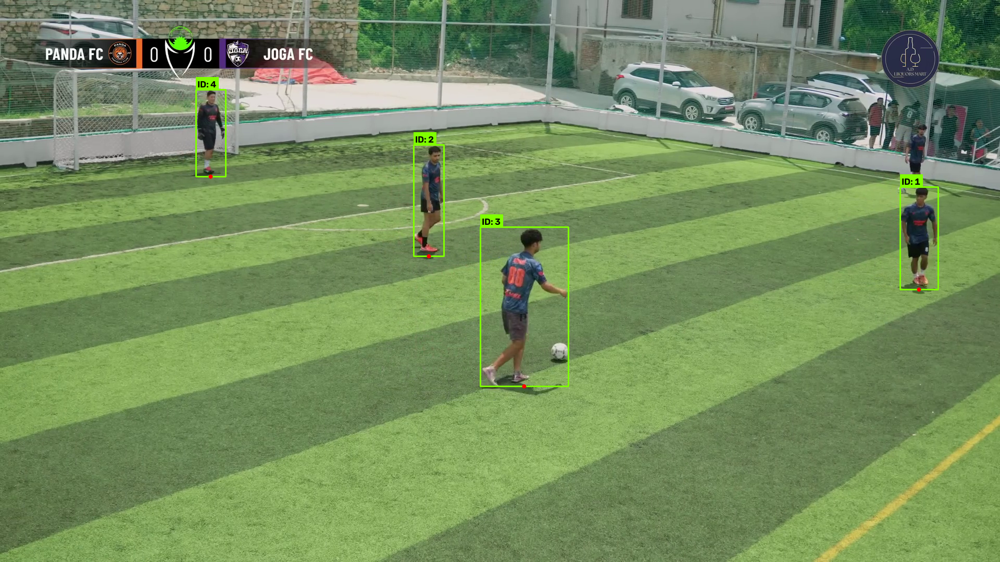

# ⚽ Football Computer Vision Analytics Pipeline (Broadcast CV MVP)

An end-to-end computer-vision and tracking analytics pipeline built for broadcast football/futsal footage (`game2.mp4` - Panda FC vs Joga FC). 

The pipeline automatically filters out advertisements, replay screens, commentary reaction scenes, and transitions by detecting match scoreboard presence, performs player detection & multi-object tracking (YOLOv11 + BotSORT), cleans tracking noise, classifies broadcast camera views, estimates spatial coordinates (both calibrated pitch-world and normalized image coordinates), computes player movement statistics, and presents findings in an interactive Streamlit dashboard.

---

## 🏗️ Pipeline Architecture

```
                       Broadcast Video (game2.mp4, 1920x1080 @ 60 FPS)
                                            │
                                            ▼
                             [1. Scoreboard Detector]
                         (Multi-cue HSV + Banner check)
                                            │
                     ┌──────────────────────┴──────────────────────┐
                     ▼                                             ▼
          [Non-Gameplay Footages]                        [Valid Gameplay Segments]
          (Filtered: Ads, Replays,                                  │
           Crowd / Reaction Box)                     ┌──────────────┴──────────────┐
                                                     ▼                             ▼
                                           [2. Scoreboard OCR]          [3. Camera View Classifier]
                                         (Tesseract: Scores/Clock)         (WIDE / SIDE / OTHER)
                                                                                   │
                                                                                   ▼
                                                                        [4. Player Tracking]
                                                                        (YOLOv11 + BotSORT)
                                                                        (Reaction Box Masked)
                                                                                   │
                                                                                   ▼
                                                                        [5. Track Cleaning]
                                                                      (Conf, Length, Segment)
                                                                                   │
                                                                                   ▼
                                                                     [6. Position Calculation]
                                                                    (Foot Reference, Homography)
                                                                                   │
                                                                                   ▼
                                                                     [7. Movement Statistics]
                                                                    (Distance, Speeds, Duration)
                                                                                   │
                                                                                   ▼
                                                                     [8. Interactive Dashboard]
                                                                      (Streamlit + Plotly UI)
```

---

## 🚀 Quickstart & How to Run

### 1. Activate Environment
In Windows PowerShell:
```powershell
.venv\Scripts\Activate.ps1
```

### 2. Run the Complete End-to-End Pipeline
Execute the master runner to process all stages sequentially:
```powershell
python src/run_pipeline.py
```

Optional CLI flags:
- `--force`: Force re-execution of all stages.
- `--skip-tracking`: Skip YOLO player tracking if raw tracking data already exists.
- `--skip-ocr`: Skip OCR extraction.
- `--max-segments N`: Process only the first `N` gameplay segments.

### 3. Launch Interactive Analytics Dashboard
```powershell
streamlit run dashboard.py
```

### 4. Run Pipeline Integrity Audit
```powershell
python src/validate_pipeline.py
```

---

## 📁 Repository Structure

```
football-cv-pipeline/
├── dashboard.py                  # Streamlit Interactive Analytics Dashboard
├── README.md                     # Project Documentation & Architecture
├── yolo11n.pt                    # Pretrained YOLOv11 Neural Network Weights
├── data/
│   ├── videos/
│   │   ├── game2.mp4             # Target Broadcast Video (Panda FC vs Joga FC)
│   │   └── game1.mp4             # Baseline Match 1 Video
│   ├── previous_game1/           # Preserved Baseline Results for Game 1
│   ├── scoreboard_frames.csv     # Frame-by-frame scoreboard presence
│   ├── scoreboard_segments.csv   # Filtered active gameplay segments
│   ├── scoreboard_data.csv       # OCR extracted match time, score & text
│   ├── camera_segments.csv       # Camera view classification (WIDE, SIDE, OTHER)
│   ├── tracking.csv              # Raw player bounding boxes & BotSORT track IDs
│   ├── clean_tracking.csv        # Filtered tracking records
│   ├── player_positions.csv      # Player foot positions (image & pitch coordinates)
│   ├── player_statistics.csv     # Per-track movement metrics, speeds & distances
│   ├── players.csv               # Team roster & track-to-player mapping
│   └── homography_wide.npy       # Calibrated 2D homography transformation matrix
├── outputs/
│   ├── player_trajectories.png   # 2D top-player trajectory map
│   ├── gameplay_coverage.png     # Broadcast match coverage timeline
│   └── scoreboard_debug/         # Visual inspection samples of detected scoreboard
└── src/
    ├── config.py                 # Centralized configuration & parameters
    ├── scoreboard_detector.py    # Scoreboard & gameplay segment detector
    ├── scoreboard_ocr.py         # Tesseract OCR engine for match clock & score
    ├── camera_classification.py  # WIDE / SIDE / OTHER angle classifier
    ├── extract_tracking.py       # YOLOv11 + BotSORT tracker with overlay masking
    ├── clean_tracking.py         # Multi-stage track cleaner & filter
    ├── calculate_positions.py    # Foot reference & coordinate mapper
    ├── calculate_statistics.py   # Distance, velocity & duration aggregator
    ├── calibration.py            # Pitch calibration & homography transformation
    ├── visualize_tracks.py       # Trajectory plotting & visualization
    ├── validate_pipeline.py      # Automated pipeline QA & audit suite
    └── run_pipeline.py           # Master end-to-end execution runner
```

---

## 🔬 Component Details

### 1. Scoreboard Detection & Gameplay Filtering
- **Design Principle**: Broadcast footage contains ads, camera transitions, highlights, and reaction cutaways. The scoreboard overlay in the top-left region (`ROI: 40, 50, 650, 145`) is present exclusively during live match gameplay.
- **Detector**: Analyzes saturation from Panda FC (orange) & Joga FC (purple) team badges, dark background banner ratio, and neon green emblem signature.
- **Output**: Generates `scoreboard_frames.csv` and merges continuous detections into `scoreboard_segments.csv`.

### 2. Scoreboard OCR (Tesseract)
- Uses `pytesseract` configured with `C:\Program Files\Tesseract-OCR\tesseract.exe`.
- Crops the scoreboard banner, upscales 3x, applies Gaussian filtering and Otsu/binary thresholding.
- Extracts live scores and match time into `scoreboard_data.csv`.

### 3. Overlay Masking & Player Tracking
- **Spatial Masking**: The broadcast includes a top-right reaction box / sponsor overlay and top-left scoreboard banner. These regions are masked out prior to YOLO inference to prevent false player detections.
- **Tracker**: YOLOv11 nano model paired with BotSORT tracking for track persistence across occlusions.

### 4. Track Cleaning & Quality Filters
Raw tracks are cleaned across 4 stages:
1. Removal of unassigned track IDs (`track_id < 0`).
2. Strict restriction to valid scoreboard gameplay segments.
3. Removal of low-confidence detections (`conf < 0.30`).
4. Pruning of short-lived spurious tracks (`frames < 15`).

### 5. Camera View Classification
Segments are categorized into:
- **`WIDE`**: Full pitch perspective with field markings visible; suited for 2D pitch homography.
- **`SIDE`**: Lateral ground angle; uses image-space or side calibration.
- **`OTHER`**: Replays, transitions, and extreme close-ups.

### 6. Dual Coordinate System
- **`image_normalized`**: Normalized coordinates $[0.0, 1.0]$ in image space:
  $$\text{norm\_x} = \frac{x_{\text{player}}}{W}, \quad \text{norm\_y} = \frac{y_{\text{player}}}{H}$$
- **`pitch_world`**: Real-world pitch coordinates in meters $(60\text{m} \times 35\text{m})$ via homography transformation matrix $\mathbf{H}$.
- Every position and statistic explicitly labels its coordinate system to prevent unit ambiguity.

---

## 📊 Analytics Dashboard

The interactive Streamlit dashboard (`dashboard.py`) offers 5 main views:
1. **Match Overview**: High-level match timeline, gameplay vs break coverage, active minutes.
2. **Player Analytics & Trajectories**: Interactive 2D player trajectory mapping, pitch view toggle, player track selector.
3. **Camera & Coverage**: Breakdown of WIDE vs SIDE broadcast footage.
4. **Scoreboard & OCR**: Timeline of scores and raw OCR recognition data.
5. **Data Integrity Audit**: Live audit of all pipeline outputs and record counts.

---

## ⚠️ Known Limitations & Engineering Tradeoffs

1. **Broadcast Camera Cuts**: Highlight and broadcast videos switch cameras frequently. Single-camera tracking IDs do not persist across camera switches without global Re-ID.
2. **Side Camera Angles**: Perspective distortion on low side angles makes pitch-world transformation approximate; normalized image coordinates are provided as a reliable fallback.
3. **Player Identity Mapping**: Tracking IDs are unconstrained integers assigned by BotSORT. Unless matched with roster jersey numbers, tracks are marked with their Track ID or "Unknown" to maintain data integrity.
4. **Highlight Video Compression**: Broadcast artifacts and motion blur during fast camera pans can cause temporary tracking fragmentation.

---

## 📸 Visual Tracking & Detection Results

### Real-Time Player Tracking & Identification (game2.mp4)
The pipeline detects players across gameplay segments using **YOLOv11 + BotSORT**, assigning persistent track IDs, bounding boxes, and ground-contact anchor points while suppressing broadcast overlay artifacts (reaction boxes and scoreboard):



A sample annotated video clip with full bounding boxes and track ID markers is available at:
- `outputs/game2_tracked_clip.mp4`

---

## 🏁 Verification & Results Summary

Run `python src/validate_pipeline.py` to audit pipeline completeness. All stages produce structured, validated CSVs and visual plots ready for downstream analytics.
